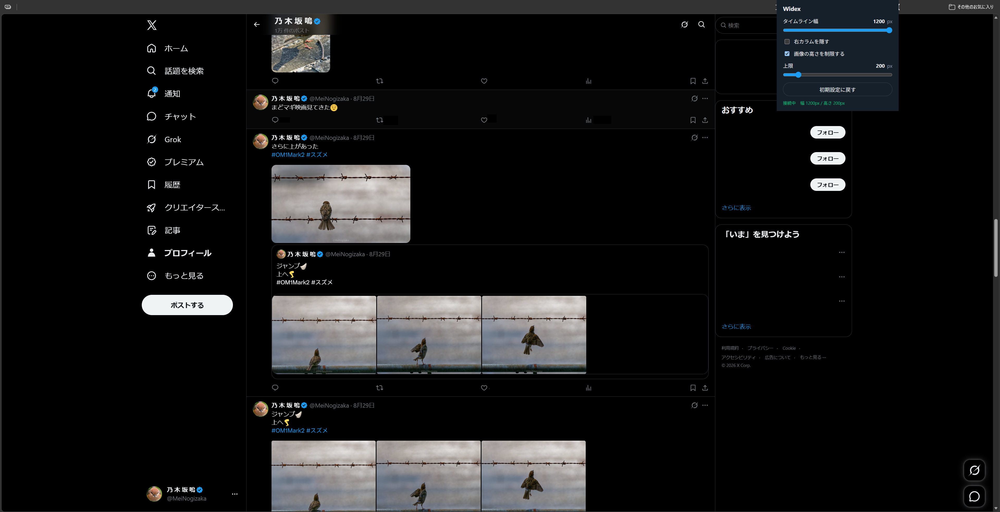

# Widexline

[日本語](README.md) · [English](README.en.md)

An unofficial Microsoft Edge / Chromium extension. It widens the x.com (formerly Twitter) timeline and caps the height of images, videos, and sensitive-content warnings. Multi-image posts are laid out in one row instead of a 2×2 grid.

This project is not affiliated with X / Twitter. It depends on the site’s DOM, so an X frontend change can break it.

Updates and bug fixes happen on the author’s schedule. There is no promise of when or how much will be addressed.



## Features

- Timeline width from 600–1200px
- Show or hide the right column (Trends)
- Cap the height of images, videos, link cards, and quotes (or leave native size)
- Pack multiple images in a single row (no stretched equal-column gaps)
- Keep X’s native photo lightbox (Back does not reload Home)
- Keep sensitive / adult-content blur while capping height
- Keep videos and GIFs playable while capping height

## Install (Edge, unpacked)

There is no build step. Clone the repository and load it.

1. Clone this repository
2. Open `edge://extensions/`
3. Turn on Developer mode
4. Load unpacked and select the cloned folder
5. Reload x.com

Chrome is the same, using `chrome://extensions/`.

On Windows, copying the source files is enough. For example:

```text
%LOCALAPPDATA%\Widexline
```

`スクリーンショット/` and `logs/` are local debug captures and are not in the public repository.

## Settings

Open the toolbar icon for the popup.

| Setting | Default | Notes |
| --- | --- | --- |
| Timeline width | 800px | 600–1200px |
| Hide right column | On | Off keeps a 420px right column |
| Limit image height | Off | Enables the max-height slider |
| Max height | 400px | 120–800px. Moving the slider turns the limit on |

Settings are stored in `chrome.storage.local` on the device. Nothing is sent elsewhere.

## Layout

```text
manifest.json   Manifest V3
content.js      Timeline patching (document_start)
styles.css      Width, height, and flattened-row styles
popup.html/js/css
icons/
docs/           Approach and maintenance (Japanese and English)
PRIVACY.md      What is not collected
```

Why it is built this way, and how to repair it when X’s DOM changes, is in [docs/architecture.en.md](docs/architecture.en.md) and [docs/maintenance.en.md](docs/maintenance.en.md). Japanese versions: [architecture](docs/architecture.md), [maintenance](docs/maintenance.md). Publishing notes: [docs/publishing.en.md](docs/publishing.en.md).

## Privacy

Widexline does not handle personal data. See [PRIVACY.md](PRIVACY.md).

A working copy of this folder may still contain saved logged-in timeline HTML and screenshots. Those paths are in `.gitignore`. **Do not push them to GitHub.**

## License

[MIT](LICENSE)
